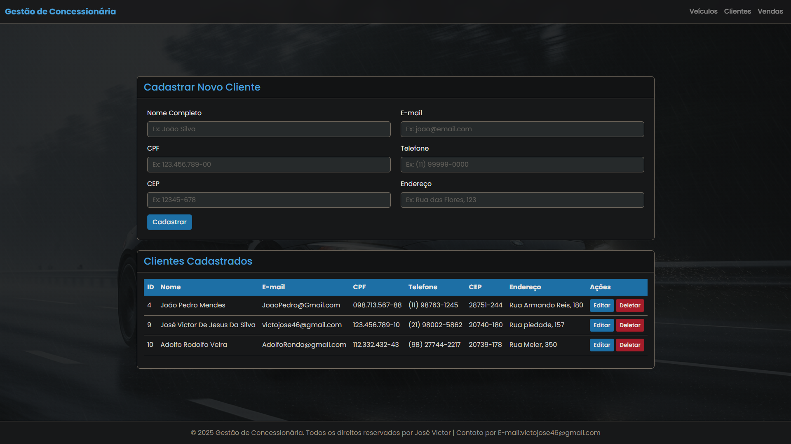
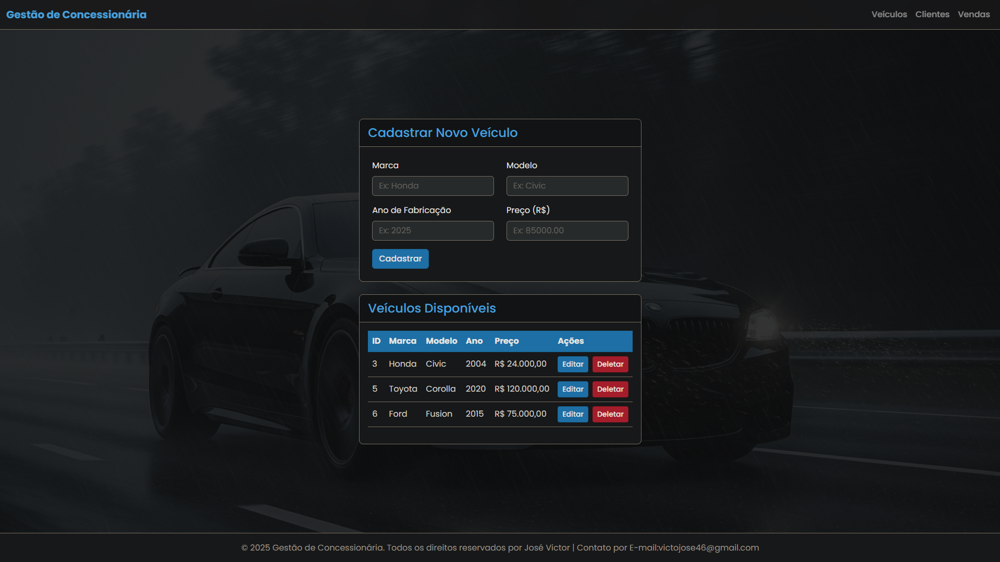
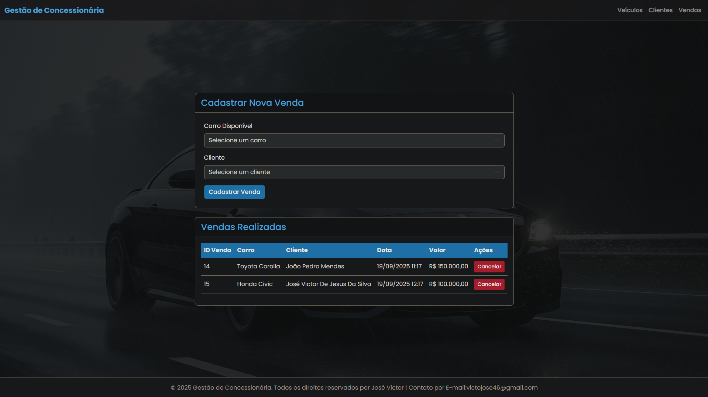

# 🚗 Sistema de Gestão de Concessionária


Este projeto é uma aplicação web full-stack para o gerenciamento de uma concessionária de veículos, desenvolvida como parte de um projeto de estudos. O sistema permite o controle completo de clientes, do estoque de veículos e do registro de vendas, utilizando uma arquitetura robusta com Spring Boot no backend e Thymeleaf para a renderização das páginas.

---

## ✨ Funcionalidades Principais

O sistema foi projetado com uma interface limpa e funcional, dividida em três módulos principais:

* **Gerenciamento de Veículos:**
    * [✔️] Cadastrar novos veículos no estoque (Marca, Modelo, Ano, Preço).
    * [✔️] Editar as informações de veículos existentes.
    * [✔️] Remover veículos do sistema.
    * [✔️] Visualizar em tempo real a lista de veículos disponíveis para venda.

* **Gerenciamento de Clientes:**
    * [✔️] Cadastrar novos clientes com dados completos (Nome, CPF, Contato, Endereço).
    * [✔️] Validação de dados no backend para garantir a integridade das informações (formato de CPF, e-mail, etc.).
    * [✔️] Editar e remover clientes cadastrados.
    * [✔️] Máscaras de formulário no frontend para uma melhor experiência do usuário.

* **Registro de Vendas:**
    * [✔️] Realizar uma venda, associando um veículo disponível a um cliente cadastrado.
    * [✔️] O sistema automaticamente marca o veículo como "vendido" e o remove da lista de disponíveis.
    * [✔️] Cancelar uma venda, fazendo com que o veículo retorne ao estoque de disponíveis.
    * [✔️] Visualizar o histórico de todas as vendas realizadas.

---

## 📸 Screenshots

[](https://www.youtube.com/watch?v=inUd3DqQBGg)

| Página Principal | Cadastro de Clientes |
| :---: | :---: |
|  |  |

| Cadastro de Veículos | Cadastro de Vendas |
| :---: | :---: |
|  |  |

---

## 🛠️ Tecnologias Utilizadas

Este projeto foi construído com as seguintes tecnologias:

* **Backend:**
    * Java (JDK 17+)
    * Spring Boot (Desenvolvimento da aplicação web)
    * Spring Data JPA & Hibernate (Mapeamento objeto-relacional)
    * Spring Web (Controllers MVC e REST)
    * Spring Boot Validation (Validação de dados)
    * JDBC (Conexão com banco de dados)
    * Maven (Gerenciador de dependências)

* **Frontend:**
    * HTML5 (Estrutura de páginas)
    * CSS3 (Estilização de páginas)
    * JavaScript (Validação e interatividade nos formulários)
    * Thymeleaf (Motor de templates no servidor)
    * Bootstrap 5 (Framework de design)

* **Banco de Dados:**
    * MySQL 8.0

* **Testes:**
    * JUnit 5 (Testes unitários)
    * Mockito (Testes com mocks)

---

## 🚀 Como Executar o Projeto Localmente

Siga os passos abaixo para configurar e executar a aplicação em seu ambiente local.

### Pré-requisitos

* Java JDK 17 ou superior.
* Maven 3.8 ou superior.
* MySQL 8.0 (ou um servidor compatível).
* Uma IDE de sua preferência (ex: IntelliJ, VS Code, NetBeans).

## 👨‍💻 Autor
* Desenvolvido por José Victor.
* E-mail: victojose46@gmail.com

### 1. Clonar o Repositório

```bash
git clone [https://github.com/JoseV-001/Sistema-de-Gerenciamento-de-Concessionaria.git](https://github.com/JoseV-001/Sistema-de-Gerenciamento-de-Concessionaria.git)
cd Sistema-de-Gerenciamento-de-Concessionaria

2. Configurar o Banco de Dados
Certifique-se de que seu servidor MySQL está em execução.

Crie um novo banco de dados com o nome gestao_concessionaria.

Execute o script `database_setup.sql` (incluído neste repositório) no seu MySQL. Ele irá automaticamente criar o banco de dados (`gestao_concessionaria`), criar todas as tabelas e inserir os dados de exemplo.

3. Configurar as Credenciais
Navegue até src/main/resources/.

Renomeie o arquivo application.properties.template para application.properties.

Abra o novo arquivo application.properties e insira a sua senha do MySQL no campo spring.datasource.password.

4. Executar a Aplicação
Abra o projeto na sua IDE.

Localize a classe GestaoConcessionariaApplication.java e execute-a.

A aplicação estará disponível em http://localhost:8080/concessionaria/.
